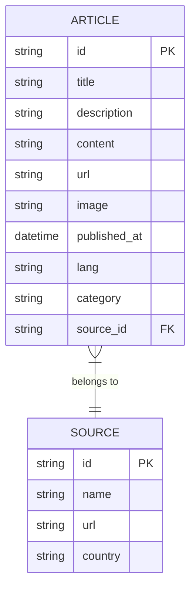
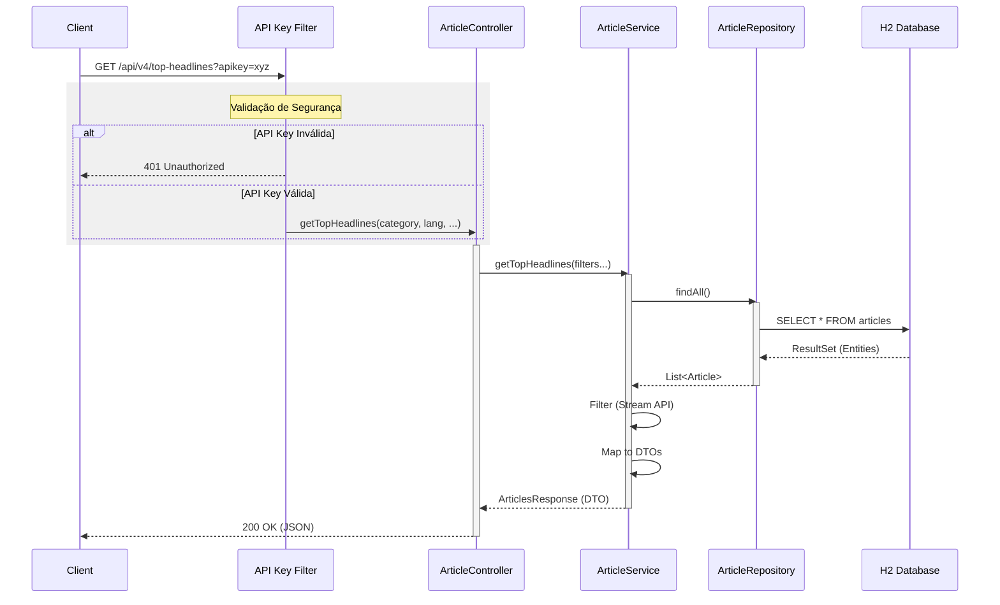

# Diagramas de Arquitetura - GNews Fake API

## Consultas e Relacionamentos (ERD)

Este diagrama representa o modelo de dados persistido via JPA (H2 Database).

## Fluxo de Execução (Diagrama de Sequência)

Este diagrama detalha o fluxo de uma requisição para listar as principais notícias (`top-headlines`), incluindo a validação de segurança simulada.

