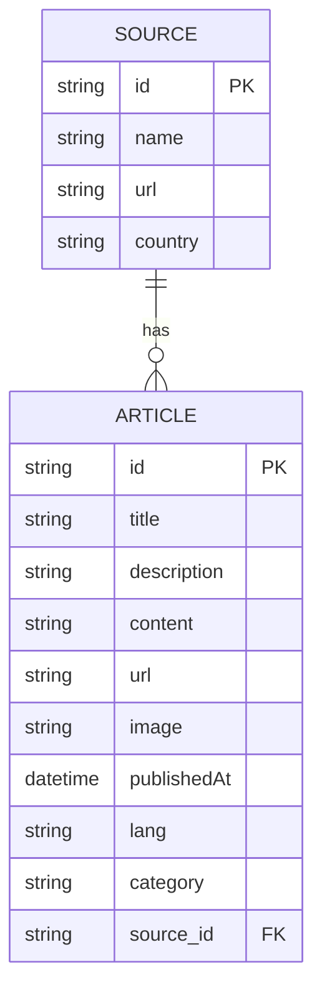
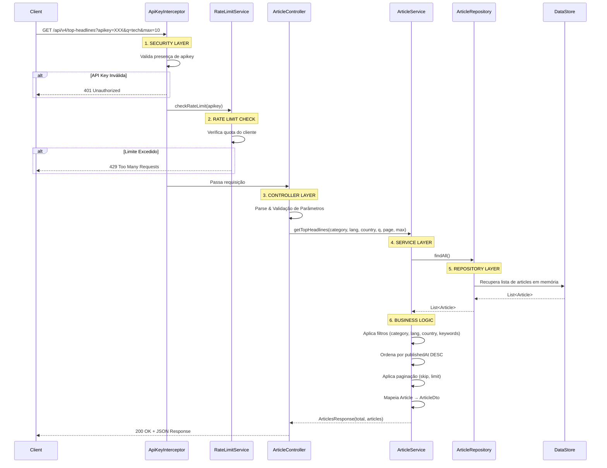
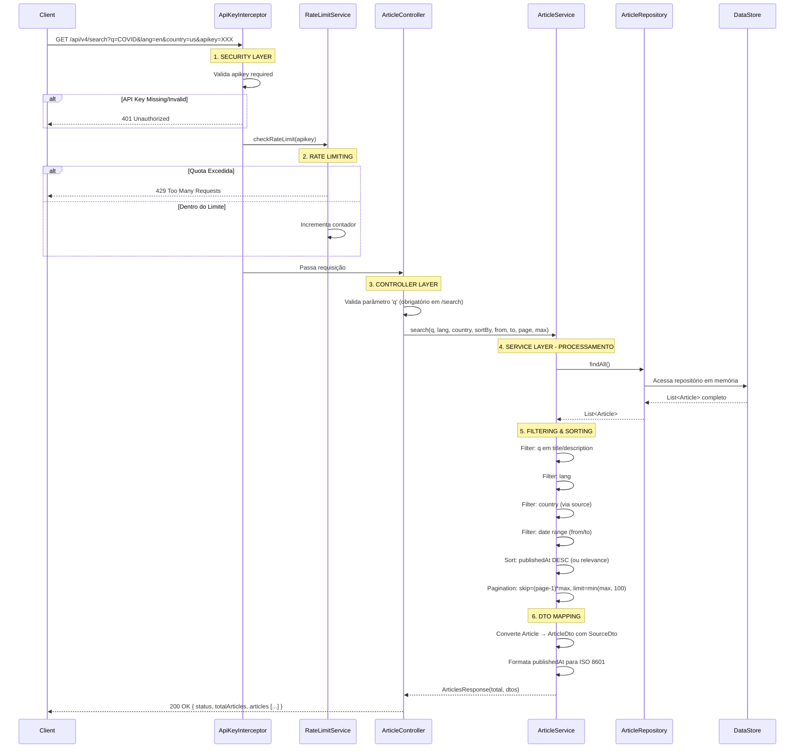

# GNews API - Diagramas Arquiteturais

## 1. Diagrama Entidade-Relacionamento (ERD)



### Descrição das Entidades

**Source (Fonte de Notícias)**
- **id**: Identificador único da fonte
- **name**: Nome da fonte (ex: BBC News, CNN)
- **url**: URL da página principal da fonte
- **country**: Código do país da fonte (ex: us, br, uk)

**Article (Artigo)**
- **id**: Identificador único do artigo
- **title**: Título do artigo
- **description**: Descrição resumida do artigo
- **content**: Conteúdo completo do artigo
- **url**: URL do artigo
- **image**: URL da imagem/thumbnail
- **publishedAt**: Data e hora de publicação
- **lang**: Código do idioma (ex: en, pt, es)
- **category**: Categoria interna para filtro (ex: breaking-news, world, nation, business, technology, entertainment, sports, science, health)
- **source_id**: Referência externa para a Source

### Relacionamento
- Uma **Source** pode ter múltiplos **Articles** (1:N)
- Um **Article** sempre pertence a uma única **Source**

---

## 2. Diagrama de Sequência - Fluxo de Requisição

### 2.1 Fluxo: GET /api/v4/top-headlines



### 2.2 Fluxo: GET /api/v4/search



---

## 3. Camadas da Aplicação

### Security Layer (Segurança)
- **ApiKeyInterceptor**: Valida a presença e validade da API key em cada requisição
- **Responsabilidade**: Rejeitar requisições não autorizadas com 401 Unauthorized

### Rate Limiting Layer
- **RateLimitService**: Controla quantas requisições cada cliente pode fazer
- **Responsabilidade**: Rejeitar com 429 Too Many Requests quando limite é excedido

### Controller Layer (Camada de Apresentação)
- **ArticleController**: Recebe requisições HTTP, valida parâmetros, orquestra a chamada ao Service
- **Endpoints**:
  - `GET /api/v4/top-headlines` - Notícias em destaque
  - `GET /api/v4/search` - Busca por palavra-chave
- **Responsabilidade**: Validação de entrada, chamada ao Service, formatação de resposta

### Service Layer (Lógica de Negócio)
- **ArticleService**: Implementa a lógica de filtering, sorting, paginação
- **Responsabilidade**:
  - Aplicar filtros (categoria, idioma, país, keywords, datas)
  - Ordenar resultados
  - Aplicar paginação
  - Mapear domínio para DTOs

### Repository Layer (Acesso a Dados)
- **ArticleRepository**: Gerencia a lista em memória de artigos
- **Responsabilidade**: CRUD operations (atualmente: findAll, saveAll)
- **Implementação**: CopyOnWriteArrayList (thread-safe)

### Data Storage
- **In-Memory Store**: CopyOnWriteArrayList mantida no ArticleRepository
- **Responsabilidade**: Armazenar dados de artigos inicializados via DataInitializer

---

## 4. Fluxos de Erro

### 401 Unauthorized
```
Client → ApiKeyInterceptor
         ↓
         Valida apikey
         ↓
         [INVÁLIDA] → Response 401 + UnauthorizedException
```

### 429 Too Many Requests
```
Client → ApiKeyInterceptor → RateLimitService
                            ↓
                            Verifica quota
                            ↓
                            [EXCEDIDA] → Response 429 + RateLimitExceededException
```

### 400 Bad Request
```
Validação no Controller ou Service
↓
Retorna GlobalExceptionHandler
↓
Response 400 + ErrorResponse
```

---

## 5. Atributos de Requisição por Endpoint

### /api/v4/top-headlines
| Parâmetro | Tipo | Obrigatório | Descrição |
|-----------|------|-------------|-----------|
| apikey | string | ✅ Sim | Chave API para autenticação |
| category | string | ❌ Não | Categoria (breaking-news, world, nation, business, etc) |
| lang | string | ❌ Não | Código de idioma (ex: en, pt) |
| country | string | ❌ Não | Código de país (ex: us, br) |
| q | string | ❌ Não | Palavras-chave para filtro |
| max | int | ❌ Não | Máximo de resultados (default: 10, max: 100) |
| page | int | ❌ Não | Número da página (default: 1) |

### /api/v4/search
| Parâmetro | Tipo | Obrigatório | Descrição |
|-----------|------|-------------|-----------|
| apikey | string | ✅ Sim | Chave API para autenticação |
| q | string | ✅ Sim | Palavras-chave de busca (obrigatório) |
| lang | string | ❌ Não | Código de idioma |
| country | string | ❌ Não | Código de país |
| sortby | string | ❌ Não | Ordenação (publishedAt, relevance) |
| from | string | ❌ Não | Data inicial (ISO 8601) |
| to | string | ❌ Não | Data final (ISO 8601) |
| max | int | ❌ Não | Máximo de resultados (default: 10, max: 100) |
| page | int | ❌ Não | Número da página (default: 1) |
